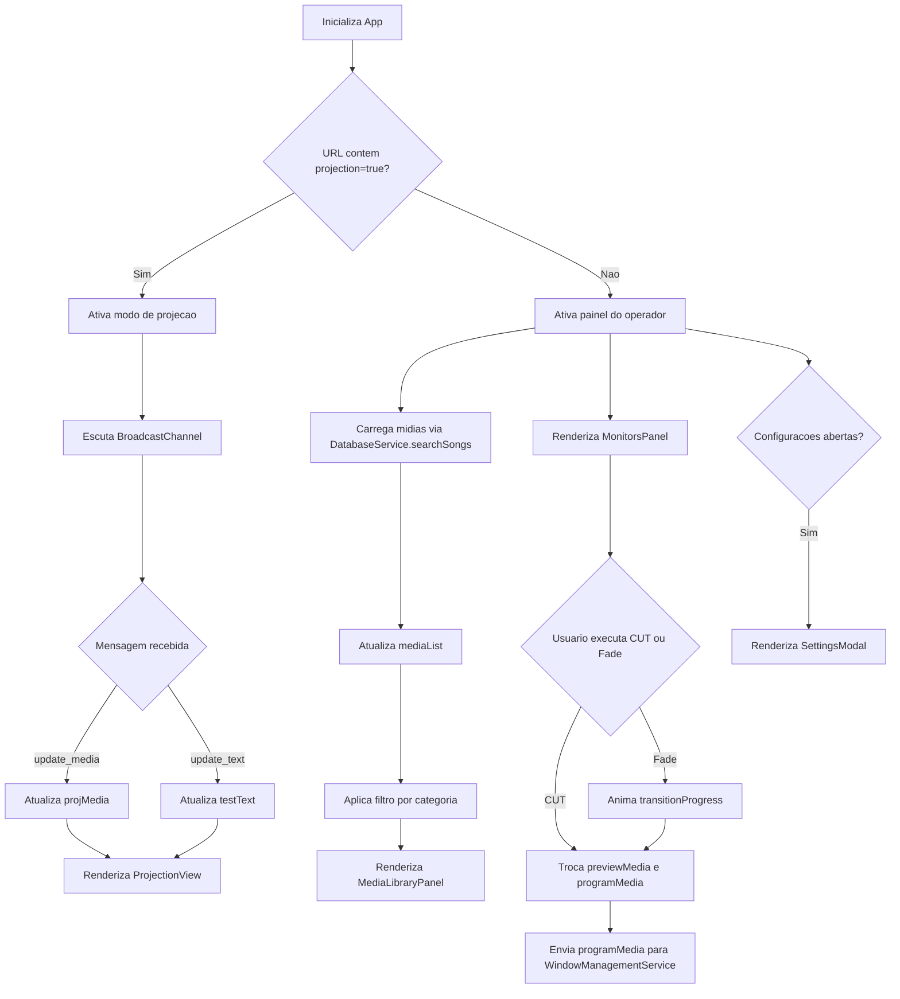

# Documentacao Tecnica: App.tsx

- Caminho original: `src/App.tsx`
- Tipo: Arquivo React/TypeScript
- Extensao: `.tsx`

## 1. Visao Geral

O arquivo **`src/App.tsx`** e o orquestrador principal do StageVision. Depois da refatoracao, ele concentra estados globais da aplicacao, efeitos de sincronizacao, integracao com [[DatabaseService.ts|DatabaseService]] e [[WindowManagementService.ts|WindowManagementService]], e delega a renderizacao visual para componentes menores em [[components(#)|src/components]]. Sua responsabilidade principal e coordenar painel do operador, modo de projecao, biblioteca de midias, transicoes, importacao de arquivos e estado do modal de configuracoes.

## 2. Assinatura do Metodo

```tsx
export default function App(): JSX.Element;
```

Componentes renderizados por composicao:

- [[ProjectionView.tsx|ProjectionView]]
- [[TitleBar.tsx|TitleBar]]
- [[MediaLibraryPanel.tsx|MediaLibraryPanel]]
- [[MonitorsPanel.tsx|MonitorsPanel]]
- [[BottomControlPanel.tsx|BottomControlPanel]]
- [[SettingsModal.tsx|SettingsModal]]

## 3. Parametros

- **`App`**: nao recebe props externas.
- O estado e inicializado internamente com **`useState`**.
- Efeitos de ciclo de vida e sincronizacao usam **`useEffect`**.
- A comunicacao com servicos externos acontece por chamadas a [[DatabaseService.ts|DatabaseService]] e [[WindowManagementService.ts|WindowManagementService]].

## 4. Fluxo de Processamento de Dados



## 5. Detalhamento das Etapas e Regras de Negocio

1. **Modo de execucao**
   - **`isProjectionMode`** e calculado a partir da query string `projection=true`.
   - Em modo de projecao, o retorno e delegado a [[ProjectionView.tsx|ProjectionView]].
   - Em modo operador, o arquivo monta o layout com paineis redimensionaveis e componentes de interface.

2. **Estados de midia**
   - **`mediaList`** guarda a biblioteca carregada do banco.
   - **`previewMedia`** representa a midia selecionada para preparacao.
   - **`programMedia`** representa a midia em exibicao.
   - **`projMedia`** representa a midia recebida pela janela de projecao.

3. **Busca, filtro e selecao**
   - A busca chama **`DatabaseService.searchSongs(searchQuery)`** em [[DatabaseService.ts|DatabaseService]] sempre que **`searchQuery`** muda.
   - **`filtered`** aplica o filtro local por **`activeCategory`**.
   - **`selectMedia`** atualiza **`previewMedia`** somente quando nao ha transicao em andamento.
   - A interface de busca, filtros e lista e renderizada por [[MediaLibraryPanel.tsx|MediaLibraryPanel]].

4. **Importacao e cadastro**
   - **`addMedia`** cadastra uma midia manual no banco via **`DatabaseService.addMedia`** em [[DatabaseService.ts|DatabaseService]].
   - **`handleFileImport`** detecta o tipo por MIME type ou extensao.
   - Arquivos de texto sao lidos como texto; imagens, audios e PDFs pequenos podem ser salvos em Base64; arquivos maiores usam **`URL.createObjectURL`**.
   - O input de arquivo permanece em **`App.tsx`**, enquanto os controles visuais de cadastro ficam em [[MediaLibraryPanel.tsx|MediaLibraryPanel]].

5. **Transicoes**
   - **`executeCut`** troca **`previewMedia`** e **`programMedia`** imediatamente.
   - **`executeFade`** usa **`requestAnimationFrame`** para atualizar **`transitionProgress`** durante **`transitionDuration`**.
   - A sincronizacao com a janela secundaria acontece quando **`programMedia`** muda.
   - A area visual de PREVIEW/PROGRAM e renderizada por [[MonitorsPanel.tsx|MonitorsPanel]], que usa [[MediaPreview.tsx|MediaPreview]] para desenhar as midias.

6. **Atalhos**
   - **`Space`** executa fade.
   - **`Enter`** executa cut.
   - **`Escape`** limpa **`programMedia`**.
   - Inputs, textareas e selects sao ignorados para nao interferir na digitacao.

7. **Administracao de banco**
   - O estado do admin SQLite permanece em **`App`** e e repassado ao [[SettingsModal.tsx|SettingsModal]].
   - **`loadDbTables`**, **`selectTable`** e **`refreshTableData`** encapsulam a carga de tabelas, schemas e dados.
   - As operacoes de persistencia sao delegadas a [[DatabaseService.ts|DatabaseService]].

8. **Comunicacao com a janela secundaria**
   - **`openProjectionWindow`** chama **`WindowManagementService.openProjectionWindow`** em [[WindowManagementService.ts|WindowManagementService]].
   - O modo de projecao escuta mensagens do **BroadcastChannel** e atualiza **`projMedia`** ou **`testText`**.
   - A tela de saida e renderizada por [[ProjectionView.tsx|ProjectionView]].

## 6. Estrutura do Retorno

```tsx
if (isProjectionMode) {
  return <ProjectionView testText={testText} media={projMedia} playback={playback} />;
}

return (
  <div>
    <input type="file" multiple onChange={handleFileImport} />
    <TitleBar />
    <Group orientation="vertical">
      <Panel id="top-panel">
        <Group orientation="horizontal">
          <MediaLibraryPanel />
          <Separator />
          <MonitorsPanel />
        </Group>
      </Panel>
      <Separator />
      <BottomControlPanel />
    </Group>
    {isSettingsOpen && <SettingsModal />}
  </div>
);
```

## 7. Pontos de Atencao

- **`App.tsx`** ainda e o dono de muitos estados, especialmente os do admin de banco. A renderizacao ja foi separada, mas uma proxima etapa pode extrair hooks como **`useMediaLibrary`**, **`useProjectionSync`** e **`useDatabaseAdmin`**.
- O lint ainda aponta uso de **`any`** em estruturas ligadas ao banco e servicos; a refatoracao atual preservou esse comportamento para evitar mudancas funcionais.
- A janela de projecao depende de **BroadcastChannel** e da query string `projection=true`.

## Links Relacionados

- [[src(#)|Pasta src]]: indice da pasta de codigo-fonte.
- [[components(#)|Pasta components]]: indice dos componentes React extraidos de **`App.tsx`**.
- [[ProjectionView.tsx|ProjectionView]]: renderiza o modo de projecao em tela cheia.
- [[TitleBar.tsx|TitleBar]]: barra superior com marca, relogio e abertura da projecao.
- [[MediaLibraryPanel.tsx|MediaLibraryPanel]]: biblioteca lateral, busca, filtros e cadastro de midias.
- [[MonitorsPanel.tsx|MonitorsPanel]]: monitores PREVIEW/PROGRAM e controles de transicao.
- [[BottomControlPanel.tsx|BottomControlPanel]]: painel inferior reservado para ferramentas futuras.
- [[SettingsModal.tsx|SettingsModal]]: modal de configuracoes e administracao SQLite.
- [[MediaPreview.tsx|MediaPreview]]: renderizacao visual de midias usada por componentes filhos.
- [[DatabaseService.ts|DatabaseService]]: servico de persistencia, busca e administracao SQLite.
- [[WindowManagementService.ts|WindowManagementService]]: servico de abertura da janela secundaria e comunicacao via BroadcastChannel.
- [[App.css|App.css]]: estilos e animacoes usados pelos previews de midia.
- [[main.tsx|main.tsx]]: ponto de montagem React que renderiza **`App`**.
