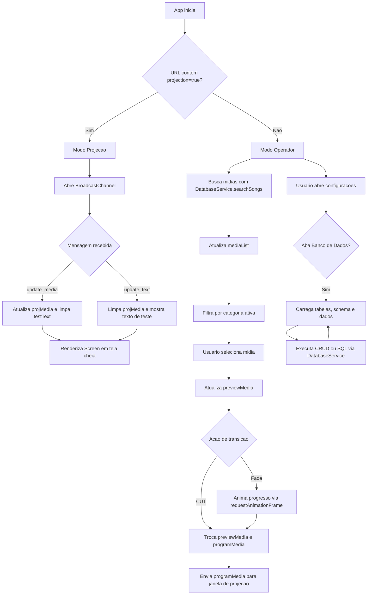

# Documentacao Tecnica: App.tsx

- Caminho original: `src/App.tsx`
- Tipo: Arquivo React/TypeScript
- Extensao: `.tsx`

## 1. Visao Geral

O arquivo **`src/App.tsx`** e o componente central do StageVision. Ele orquestra a interface principal do operador, a janela secundaria de projecao, a biblioteca de midias, as transicoes entre **PREVIEW** e **PROGRAM**, a importacao de arquivos locais e o painel de administracao do banco SQLite WASM. O componente tambem integra os servicos **`DatabaseService`** e **`WindowManagementService`** para persistencia, busca, execucao SQL e comunicacao entre janelas via **BroadcastChannel**.

## 2. Assinatura do Metodo

Como o arquivo nao define uma classe, o ponto de entrada principal e o componente funcional **`App`**. O arquivo tambem declara os helpers **`fmt`**, **`Icon`** e **`Screen`**.

```tsx
const fmt = (s: number) => string;

const Icon = ({
  type,
  size = 13,
}: {
  type: MediaItem["type"];
  size?: number;
}) => JSX.Element;

const Screen = ({
  item,
  playback,
}: {
  item: MediaItem | null;
  playback: number;
}) => JSX.Element;

export default function App(): JSX.Element;
```

## 3. Parametros

- **`App`**: nao recebe parametros externos. Todo o comportamento e controlado por estados internos, efeitos React, eventos de interface e servicos importados.
- **`fmt(s)`** (`number`): recebe um tempo em segundos e retorna uma string no formato `00:mm:ss`.
- **`Icon({ type, size })`**:
  - **`type`** (`MediaItem["type"]`): define o path SVG usado para representar o tipo da midia.
  - **`size`** (`number`, opcional): define largura e altura do SVG. O valor padrao e `13`.
- **`Screen({ item, playback })`**:
  - **`item`** (`MediaItem | null`): midia renderizada na tela. Quando nulo, retorna uma tela preta.
  - **`playback`** (`number`): contador em segundos usado para exibir timecode e progresso simulado em videos e audios.

## 4. Fluxo de Processamento de Dados



## 5. Detalhamento das Etapas e Regras de Negocio

1. **Inicializacao e modo de execucao**
   - **`isProjectionMode`** e calculado pela presenca de `projection=true` na query string.
   - Quando **`isProjectionMode`** e verdadeiro, o arquivo renderiza apenas a tela de projecao em tela cheia.
   - Quando e falso, o arquivo renderiza o painel completo do operador.

2. **Renderizacao de midias**
   - **`Screen`** decide a saida visual a partir de **`item.type`**.
   - Para **`image`**, renderiza a imagem usando **`item.content`** como `src`; sem conteudo, mostra um fallback visual.
   - Para **`video`**, renderiza um preview grafico com timecode calculado por **`fmt(playback)`** e barra de progresso simulada.
   - Para **`audio`**, renderiza barras de equalizador e timecode.
   - Para os demais tipos tratados como slide, renderiza texto em area central com fallback `[Slide em branco]`.
   - Quando **`item`** e `null`, a tela fica preta.

3. **Biblioteca de midias**
   - **`mediaList`** armazena os itens retornados por **`DatabaseService.searchSongs(searchQuery)`**.
   - **`filtered`** aplica o filtro de categoria ativa, retornando todos os itens quando **`activeCategory`** e `"all"`.
   - **`selectMedia`** move uma midia para **`previewMedia`**, desde que nenhuma transicao esteja em andamento.
   - **`handleDeleteMedia`** remove a midia pelo **`id`**, limpa o menu contextual e tambem remove referencias em **`previewMedia`** ou **`programMedia`** quando necessario.

4. **Cadastro e importacao de arquivos**
   - **`addMedia`** cria midias manuais usando nome, tipo e conteudo informados no formulario.
   - Se o nome nao tiver extensao, o codigo adiciona uma extensao padrao por tipo, como `jpg`, `mp4`, `mp3`, `txt`, `seq`, `col`, `timer` ou `bin`.
   - **`triggerFileImport`** abre o input de arquivo escondido.
   - **`handleFileImport`** percorre todos os arquivos selecionados, detecta o tipo por MIME type ou extensao e persiste cada item com **`DatabaseService.addMedia`**.
   - Arquivos de texto sao lidos com **`FileReader.readAsText`**.
   - Imagens, audios e PDFs menores que `12 MB` sao convertidos para Base64 com **`readAsDataURL`**.
   - Demais arquivos usam **`URL.createObjectURL`** como conteudo temporario.

5. **Transicoes PREVIEW/PROGRAM**
   - **`executeCut`** troca imediatamente **`previewMedia`** e **`programMedia`**.
   - **`executeFade`** bloqueia novas transicoes com **`isTransitioning`**, calcula **`transitionProgress`** com **`requestAnimationFrame`** e, ao fim de **`transitionDuration`** (`600 ms`), faz a mesma troca de midias.
   - O efeito que observa **`programMedia`** chama **`WindowManagementService.sendMedia(programMedia)`** no modo operador para sincronizar a janela de projecao.

6. **Comunicacao com a janela de projecao**
   - **`openProjectionWindow`** delega a abertura da janela secundaria para **`WindowManagementService.openProjectionWindow`**.
   - A janela de projecao escuta o canal retornado por **`WindowManagementService.getChannel`**.
   - Mensagens com **`action: "update_media"`** atualizam **`projMedia`**.
   - Mensagens com **`action: "update_text"`** limpam a midia e exibem **`testText`**.
   - Ao desmontar o efeito da janela de projecao, o canal e fechado por **`WindowManagementService.closeChannel`**.

7. **Relogio, playback e atalhos**
   - **`clock`** e atualizado a cada segundo com a hora local.
   - **`playback`** e incrementado a cada segundo e reiniciado ao chegar em `300`.
   - No modo operador, o listener de teclado ignora inputs, textareas e selects.
   - **`Space`** executa fade, **`Enter`** executa cut e **`Escape`** limpa **`programMedia`**.

8. **Painel de configuracoes e administracao SQLite**
   - Quando o modal de configuracoes esta aberto na aba **`Banco de Dados`**, **`loadDbTables`** carrega as tabelas e limpa resultados SQL anteriores.
   - **`selectTable`** define a tabela ativa e busca, em paralelo, o schema e os dados da tabela.
   - **`refreshTableData`** recarrega os dados da tabela selecionada e a lista de tabelas.
   - O painel permite resetar banco, criar e remover tabelas, adicionar colunas, inserir linhas, editar linhas, excluir linhas e executar SQL bruto.
   - Operacoes destrutivas de interface como remover tabela ou linha usam **`confirm`** antes de chamar o servico.

9. **Dependencias auxiliares**
   - **`DatabaseService`** centraliza persistencia e consultas no SQLite WASM por worker.
   - **`WindowManagementService`** centraliza abertura de janela e troca de mensagens por **BroadcastChannel**.
   - **`react-resizable-panels`** fornece **`Panel`**, **`Group`** e **`Separator`** para os paineis redimensionaveis da interface.
   - **`App.css`** complementa estilos e animacoes usados pela interface.

## 6. Estrutura do Retorno

O retorno final do arquivo e uma arvore TSX que varia conforme o modo de execucao.

```tsx
// Modo projecao
if (isProjectionMode) {
  return (
    <div>
      {testText ? <div>{testText}</div> : <Screen item={projMedia} playback={playback} />}
    </div>
  );
}

// Modo operador
return (
  <div>
    <input type="file" multiple onChange={handleFileImport} />
    {/* titlebar, biblioteca, paineis PREVIEW/PROGRAM, transicoes e modal */}
  </div>
);
```

As principais estruturas de estado manipuladas pelo componente sao:

```ts
type MediaItem = {
  id: string;
  name: string;
  title?: string;
  type: "image" | "video" | "audio" | "slide" | "music" | "sequence" | "collection" | "tempo" | "arquivo";
  content?: string;
  duration?: string;
  artist?: string;
  lyrics?: string;
  created_at?: string;
};

type DbTableState = {
  dbTables: { name: string; rowCount: number }[];
  dbSelectedTable: string | null;
  dbSchema: any[];
  dbData: any[];
  dbAdminTab: "schema" | "data" | "sql";
  rawQueryText: string;
  rawQueryResult: any[] | null;
  rawQueryError: string | null;
};
```

## 7. Pontos de Atencao

- **`App.tsx`** concentra muitas responsabilidades: interface principal, projecao, CRUD de banco, importacao de arquivos e atalhos. Futuras manutencoes podem se beneficiar da extracao de componentes menores.
- O armazenamento de arquivos grandes usa **`URL.createObjectURL`**, que nao e persistente entre sessoes como Base64 salvo no SQLite.
- O console SQL executa texto livre informado na interface; isso e util para administracao local, mas exige cuidado em ambientes compartilhados.
- A deteccao do modo de projecao depende exclusivamente da query string `projection=true`.
