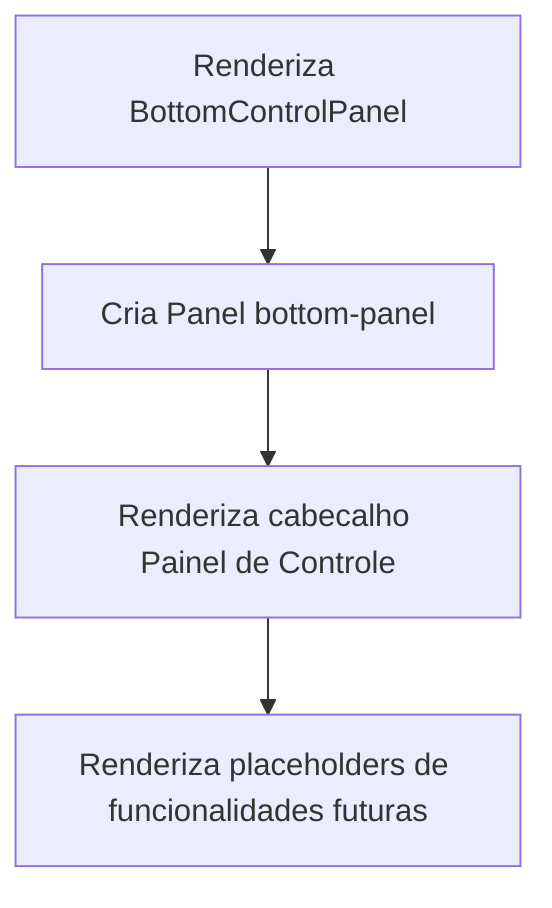

# Documentacao Tecnica: BottomControlPanel.tsx

- Caminho original: `src/components/BottomControlPanel.tsx`
- Tipo: Componente React
- Extensao: `.tsx`

## 1. Visao Geral

O componente **`BottomControlPanel`** renderiza o painel inferior redimensionavel da interface. Atualmente ele funciona como area reservada para funcionalidades futuras, exibindo atalhos visuais para cronometro, agenda, efeitos e scriptura.

## 2. Assinatura do Metodo

```tsx
export function BottomControlPanel(): JSX.Element;
```

## 3. Parametros

- Este componente nao recebe parametros.

## 4. Fluxo de Processamento de Dados



## 5. Detalhamento das Etapas e Regras de Negocio

1. **Painel**
   - Usa **`Panel`** de **`react-resizable-panels`**.
   - Define **`defaultSize={40}`** e **`minSize={15}`**.

2. **Cabecalho**
   - Exibe o titulo `Painel de Controle` e a indicacao de area reservada.

3. **Placeholders**
   - Renderiza os itens `Cronometro`, `Agenda`, `Efeitos` e `Scriptura`.
   - Cada item tem icone SVG e opacidade reduzida.

## 6. Estrutura do Retorno

```tsx
<BottomControlPanel />
```

## 7. Pontos de Atencao

- O componente nao possui interacoes funcionais neste momento.
- A responsabilidade atual e preservar o espaco de layout para futuras ferramentas.
