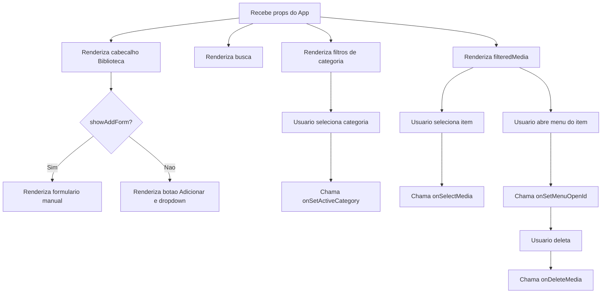

# Documentacao Tecnica: MediaLibraryPanel.tsx

- Caminho original: `src/components/MediaLibraryPanel.tsx`
- Tipo: Componente React
- Extensao: `.tsx`

## 1. Visao Geral

O componente **`MediaLibraryPanel`** renderiza a biblioteca lateral de midias. Ele exibe cabecalho, botao de importacao, menu para tipos especiais, formulario de cadastro manual, busca FTS5, filtros por categoria e lista de midias com menu de exclusao.

## 2. Assinatura do Metodo

```tsx
type MediaCategory = "all" | MediaItem["type"];

type MediaLibraryPanelProps = {
  activeCategory: MediaCategory;
  filteredMedia: MediaItem[];
  menuOpenId: string | null;
  newMediaContent: string;
  newMediaName: string;
  newMediaType: MediaItem["type"];
  searchQuery: string;
  showAddDropdown: boolean;
  showAddForm: boolean;
  onAddMedia: (event: React.FormEvent) => void;
  onDeleteMedia: (id: string, event: React.MouseEvent) => void;
  onSelectMedia: (item: MediaItem) => void;
  onSetActiveCategory: (category: MediaCategory) => void;
  onSetMenuOpenId: (id: string | null) => void;
  onSetNewMediaContent: (value: string) => void;
  onSetNewMediaName: (value: string) => void;
  onSetNewMediaType: (type: MediaItem["type"]) => void;
  onSetSearchQuery: (value: string) => void;
  onSetShowAddDropdown: (value: boolean) => void;
  onSetShowAddForm: (value: boolean) => void;
  onTriggerFileImport: () => void;
};

export function MediaLibraryPanel(props: MediaLibraryPanelProps): JSX.Element;
```

## 3. Parametros

- **`activeCategory`**: categoria atualmente selecionada.
- **`filteredMedia`**: lista ja filtrada pelo componente pai.
- **`menuOpenId`**: id da midia com menu contextual aberto.
- **`newMediaName`**, **`newMediaType`**, **`newMediaContent`**: campos do formulario de cadastro manual.
- **`searchQuery`**: texto de busca.
- **`showAddDropdown`** e **`showAddForm`**: controlam exibicao do menu e formulario.
- Callbacks **`onAddMedia`**, **`onDeleteMedia`**, **`onSelectMedia`** e setters repassados pelo **`App.tsx`** controlam as acoes.

## 4. Fluxo de Processamento de Dados



## 5. Detalhamento das Etapas e Regras de Negocio

1. **Categorias**
   - **`categories`** define a ordem de exibicao dos filtros.
   - **`categoryLabels`** define os rotulos visuais de cada categoria.

2. **Importacao e cadastro**
   - O botao `Adicionar +` chama **`onTriggerFileImport`**.
   - O dropdown permite criar tipos especiais como letras, colecao, sequencia e tempo.
   - O formulario manual chama **`onAddMedia`** no submit.

3. **Busca**
   - O input atualiza **`searchQuery`** via **`onSetSearchQuery`**.
   - A busca real e executada fora do componente, em **`App.tsx`**.

4. **Lista de midias**
   - Cada item mostra icone por tipo usando **`Icon`**.
   - Clique no item chama **`onSelectMedia`**.
   - O menu contextual permite deletar a midia com **`onDeleteMedia`**.

## 6. Estrutura do Retorno

```tsx
<MediaLibraryPanel
  activeCategory={activeCategory}
  filteredMedia={filtered}
  menuOpenId={menuOpenId}
  newMediaName={newMediaName}
  newMediaType={newMediaType}
  searchQuery={searchQuery}
  onAddMedia={addMedia}
  onSelectMedia={selectMedia}
/>
```

## 7. Pontos de Atencao

- O componente e controlado por props; nao possui estado proprio.
- A filtragem e a persistencia de midias ficam em **`App.tsx`** e **`DatabaseService`**.
