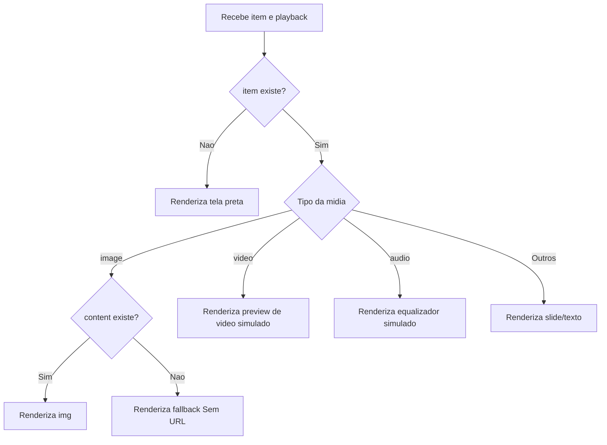

# Documentacao Tecnica: MediaPreview.tsx

- Caminho original: `src/components/MediaPreview.tsx`
- Tipo: Componente/helper React
- Extensao: `.tsx`

## 1. Visao Geral

O arquivo **`MediaPreview.tsx`** centraliza a representacao visual de midias no StageVision. Ele exporta **`Icon`**, usado para desenhar icones SVG por tipo de midia, e **`Screen`**, usado para renderizar imagens, videos simulados, audios simulados, slides e estados vazios.

## 2. Assinatura do Metodo

```tsx
const fmt = (s: number) => string;

export const Icon = ({
  type,
  size = 13,
}: {
  type: MediaItem["type"];
  size?: number;
}) => JSX.Element;

export const Screen = ({
  item,
  playback,
}: {
  item: MediaItem | null;
  playback: number;
}) => JSX.Element;
```

## 3. Parametros

- **`fmt(s)`** (`number`): recebe segundos e retorna um timecode no formato `00:mm:ss`.
- **`Icon.type`** (`MediaItem["type"]`): define qual path SVG sera usado.
- **`Icon.size`** (`number`, opcional): tamanho do SVG; padrao `13`.
- **`Screen.item`** (`MediaItem | null`): midia a ser renderizada.
- **`Screen.playback`** (`number`): contador usado para timecode e barra de progresso simulada.

## 4. Fluxo de Processamento de Dados



## 5. Detalhamento das Etapas e Regras de Negocio

1. **Icones**
   - **`Icon`** usa um mapa **`Record<MediaItem["type"], string>`** para associar cada tipo de midia a um path SVG.
   - O path e dividido por `M` e renderizado como uma lista de elementos **`<path>`**.

2. **Renderizacao de imagem**
   - Para **`item.type === "image"`**, o componente usa **`item.content`** como `src`.
   - Quando **`content`** nao existe, renderiza um bloco de fallback com texto `Sem URL`.

3. **Renderizacao simulada de video e audio**
   - Videos exibem icone, timecode e barra de progresso baseada em **`playback / 300`**.
   - Audios exibem barras com classes **`eq-bar`** e timecode.

4. **Slides e demais tipos**
   - Qualquer tipo nao tratado explicitamente por imagem, video ou audio e exibido como conteudo textual.
   - Se **`item.content`** estiver vazio, mostra `[Slide em branco]`.

## 6. Estrutura do Retorno

```tsx
<Icon type="image" size={13} />
<Screen item={mediaItemOrNull} playback={playback} />
```

## 7. Pontos de Atencao

- As animacoes visuais de video e audio dependem de classes definidas em **`App.css`**.
- **`Screen`** nao executa reproducao real de audio/video; ele cria uma representacao visual simulada.
