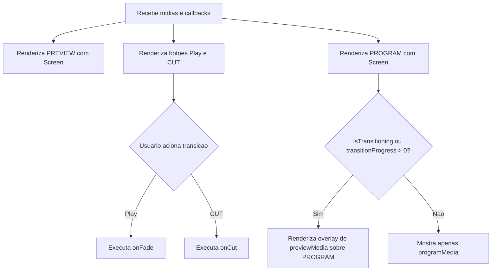

# Documentacao Tecnica: MonitorsPanel.tsx

- Caminho original: `src/components/MonitorsPanel.tsx`
- Tipo: Componente React
- Extensao: `.tsx`

## 1. Visao Geral

O componente **`MonitorsPanel`** renderiza a area central de operacao com os monitores **PREVIEW** e **PROGRAM**. Ele recebe as midias atuais, o estado da transicao e callbacks para executar fade, cut e limpeza do programa.

## 2. Assinatura do Metodo

```tsx
type MonitorsPanelProps = {
  isTransitioning: boolean;
  playback: number;
  previewMedia: MediaItem | null;
  programMedia: MediaItem | null;
  transitionProgress: number;
  onClearProgram: () => void;
  onCut: () => void;
  onFade: () => void;
};

function MonitorFrame({
  children,
  label,
  actions,
}: {
  children: React.ReactNode;
  label: string;
  actions?: React.ReactNode;
}): JSX.Element;

export function MonitorsPanel(props: MonitorsPanelProps): JSX.Element;
```

## 3. Parametros

- **`isTransitioning`** (`boolean`): indica se uma transicao esta em andamento.
- **`playback`** (`number`): contador enviado aos componentes **`Screen`**.
- **`previewMedia`** (`MediaItem | null`): midia exibida no monitor PREVIEW.
- **`programMedia`** (`MediaItem | null`): midia exibida no monitor PROGRAM.
- **`transitionProgress`** (`number`): percentual de opacidade do overlay durante fade.
- **`onClearProgram`** (`() => void`): limpa o PROGRAM.
- **`onCut`** (`() => void`): executa corte seco.
- **`onFade`** (`() => void`): executa transicao suave.

## 4. Fluxo de Processamento de Dados



## 5. Detalhamento das Etapas e Regras de Negocio

1. **MonitorFrame**
   - Mantem proporcao 16:9 usando container queries.
   - Recebe **`children`** para renderizar o conteudo do monitor.

2. **PREVIEW**
   - Renderiza **`previewMedia`** usando **`Screen`**.

3. **Controles de transicao**
   - Botao `Play` chama **`onFade`**.
   - Botao `CUT` chama **`onCut`**.
   - Ambos respeitam **`isTransitioning`** por meio de `disabled`.

4. **PROGRAM**
   - Renderiza **`programMedia`** usando **`Screen`**.
   - Botoes `FTB` e `LIMPAR` chamam **`onClearProgram`**.

5. **Overlay de fade**
   - Quando ha transicao, **`previewMedia`** e desenhado sobre **`programMedia`** com opacidade **`transitionProgress / 100`**.

## 6. Estrutura do Retorno

```tsx
<MonitorsPanel
  isTransitioning={isTransitioning}
  playback={playback}
  previewMedia={previewMedia}
  programMedia={programMedia}
  transitionProgress={transitionProgress}
  onClearProgram={() => setProgramMedia(null)}
  onCut={executeCut}
  onFade={executeFade}
/>
```

## 7. Pontos de Atencao

- O componente nao troca midias internamente; ele apenas chama callbacks recebidos de **`App.tsx`**.
- A transicao visual depende de **`transitionProgress`** calculado fora do componente.
