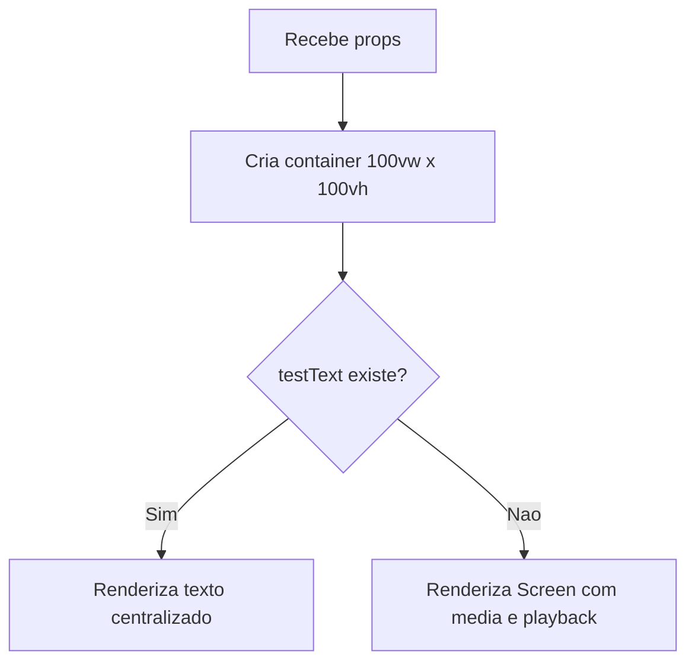

# Documentacao Tecnica: ProjectionView.tsx

- Caminho original: `src/components/ProjectionView.tsx`
- Tipo: Componente React
- Extensao: `.tsx`

## 1. Visao Geral

O componente **`ProjectionView`** renderiza a janela secundaria de projecao em tela cheia. Ele recebe texto de teste, midia ativa e contador de playback, decidindo entre mostrar texto centralizado ou delegar a exibicao da midia para **`Screen`**.

## 2. Assinatura do Metodo

```tsx
type ProjectionViewProps = {
  testText: string;
  media: MediaItem | null;
  playback: number;
};

export function ProjectionView(props: ProjectionViewProps): JSX.Element;
```

## 3. Parametros

- **`testText`** (`string`): texto exibido quando existe uma mensagem de teste.
- **`media`** (`MediaItem | null`): midia que sera renderizada por **`Screen`** quando nao houver texto de teste.
- **`playback`** (`number`): contador encaminhado para **`Screen`**.

## 4. Fluxo de Processamento de Dados



## 5. Detalhamento das Etapas e Regras de Negocio

1. **Container de projecao**
   - Usa **`100vw`** e **`100vh`** para ocupar toda a janela.
   - Mantem fundo preto, alinhamento central e overflow oculto.

2. **Texto de teste**
   - Quando **`testText`** tem valor, a midia nao e exibida.
   - O texto usa cor verde de destaque **`#10B981`**.

3. **Midia**
   - Quando **`testText`** esta vazio, a renderizacao e delegada para **`Screen`**.

## 6. Estrutura do Retorno

```tsx
<ProjectionView testText={testText} media={projMedia} playback={playback} />
```

## 7. Pontos de Atencao

- Este componente nao abre a janela de projecao; essa responsabilidade permanece em **`WindowManagementService`**.
