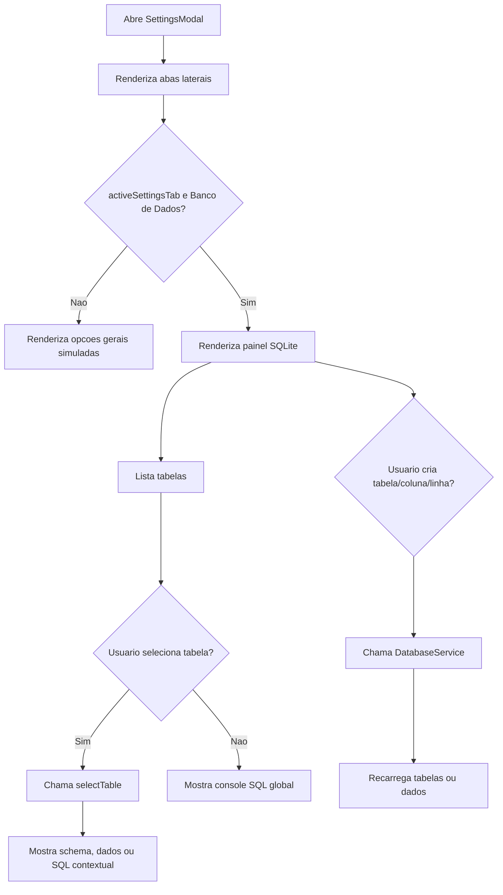

# Documentacao Tecnica: SettingsModal.tsx

- Caminho original: `src/components/SettingsModal.tsx`
- Tipo: Componente React
- Extensao: `.tsx`

## 1. Visao Geral

O componente **`SettingsModal`** renderiza o modal de configuracoes do StageVision. Sua principal responsabilidade funcional e concentrar a interface de administracao do SQLite WASM: listagem de tabelas, criacao e remocao de tabelas, exibicao de schema, insercao, edicao e exclusao de linhas, alem de console SQL global ou contextual.

## 2. Assinatura do Metodo

```tsx
type StateSetter<T> = React.Dispatch<React.SetStateAction<T>>;

type DbNewTableCol = {
  name: string;
  type: string;
  pk: boolean;
  notnull: boolean;
};

type SettingsModalProps = {
  activeSettingsTab: string;
  setActiveSettingsTab: StateSetter<string>;
  setIsSettingsOpen: StateSetter<boolean>;
  dbTables: any[];
  dbSelectedTable: string | null;
  dbSchema: any[];
  dbData: any[];
  dbAdminTab: any;
  rawQueryText: string;
  rawQueryResult: any[] | null;
  rawQueryError: string | null;
  dbShowCreateTable: boolean;
  dbNewTableName: string;
  dbNewTableCols: DbNewTableCol[];
  loadDbTables: () => Promise<void>;
  refreshTableData: (tableName?: string) => Promise<void>;
  selectTable: (name: string) => Promise<void>;
};

export function SettingsModal(props: SettingsModalProps): JSX.Element;
```

## 3. Parametros

- **`activeSettingsTab`**: aba ativa no menu lateral.
- **`setActiveSettingsTab`** e **`setIsSettingsOpen`**: controlam navegacao e fechamento do modal.
- **`dbTables`**: tabelas carregadas do banco, com nome e contagem de linhas.
- **`dbSelectedTable`**: tabela atualmente selecionada.
- **`dbSchema`** e **`dbData`**: schema e dados da tabela selecionada.
- **`dbAdminTab`**: subaba ativa no admin (`schema`, `data` ou `sql`).
- **`rawQueryText`**, **`rawQueryResult`**, **`rawQueryError`**: estado do console SQL.
- **`dbShowCreateTable`**, **`dbNewTableName`**, **`dbNewTableCols`**: estado do formulario de criacao de tabela.
- **`dbShowAddCol`**, **`dbNewColName`**, **`dbNewColType`**, **`dbNewColNotnull`**, **`dbNewColDefault`**: estado de criacao de coluna.
- **`dbEditingRowid`**, **`dbEditValues`**, **`dbShowAddRow`**, **`dbNewRowValues`**: estado de edicao e insercao de linhas.
- **`loadDbTables`**, **`refreshTableData`**, **`selectTable`**: funcoes de carga definidas no componente pai.

## 4. Fluxo de Processamento de Dados



## 5. Detalhamento das Etapas e Regras de Negocio

1. **Estrutura do modal**
   - Renderiza overlay fixo com corpo central.
   - Possui cabecalho, sidebar, area de conteudo e rodape.

2. **Sidebar**
   - Lista abas como `Geral`, `Conta`, `Permissoes`, `Aparencia`, `Notificacoes`, `Atalhos`, `Banco de Dados` e `Avancado`.
   - A aba ativa altera o conteudo exibido.

3. **Admin SQLite**
   - A coluna esquerda lista **`dbTables`**.
   - `+ Nova Tabela` ativa o formulario de criacao.
   - `Console SQL` limpa selecao de tabela e abre o console global.
   - `Resetar DB` chama **`DatabaseService.resetDatabase`** apos confirmacao.

4. **Criacao de tabela**
   - Monta colunas com nome, tipo, primary key e not null.
   - Exibe uma previa SQL textual antes de criar.
   - Chama **`DatabaseService.createTable`** e depois **`loadDbTables`** e **`selectTable`**.

5. **Tabela selecionada**
   - Subabas `Estrutura`, `Dados` e `Console SQL` controlam o modo de visualizacao.
   - `Estrutura` mostra **`dbSchema`** e permite adicionar coluna.
   - `Dados` mostra **`dbData`**, permite inserir, editar e excluir linhas.
   - `Console SQL` executa comandos por **`DatabaseService.runRawQuery`**.

6. **Console SQL global**
   - Quando nao ha tabela selecionada, o componente mostra um console SQL geral.
   - Inclui atalhos como listar tabelas, listar indices, ver songs, contar por tipo e limpar songs.

## 6. Estrutura do Retorno

```tsx
<SettingsModal
  activeSettingsTab={activeSettingsTab}
  dbTables={dbTables}
  dbSelectedTable={dbSelectedTable}
  dbSchema={dbSchema}
  dbData={dbData}
  rawQueryText={rawQueryText}
  rawQueryResult={rawQueryResult}
  rawQueryError={rawQueryError}
  loadDbTables={loadDbTables}
  refreshTableData={refreshTableData}
  selectTable={selectTable}
/>
```

## 7. Pontos de Atencao

- O componente ainda recebe muitos estados e setters. Uma futura melhoria natural e extrair a logica de banco para um hook, como **`useDatabaseAdmin`**.
- O console SQL executa texto livre, portanto deve ser usado com cuidado.
- Operacoes destrutivas usam **`confirm`**, mas nao ha camada adicional de permissao.
