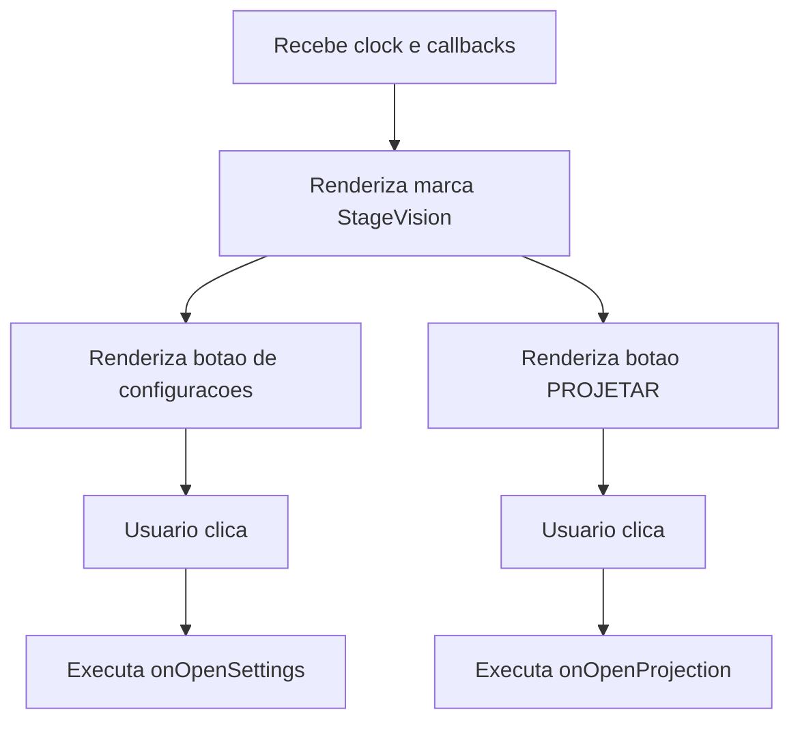

# Documentacao Tecnica: TitleBar.tsx

- Caminho original: `src/components/TitleBar.tsx`
- Tipo: Componente React
- Extensao: `.tsx`

## 1. Visao Geral

O componente **`TitleBar`** renderiza a barra superior do StageVision. Ele exibe a marca, a versao visual, o botao de configuracoes, o botao para abrir a janela de projecao e o relogio recebido de **`App.tsx`**.

## 2. Assinatura do Metodo

```tsx
type TitleBarProps = {
  clock: string;
  onOpenProjection: () => void;
  onOpenSettings: () => void;
};

export function TitleBar(props: TitleBarProps): JSX.Element;
```

## 3. Parametros

- **`clock`** (`string`): hora formatada exibida na barra.
- **`onOpenProjection`** (`() => void`): callback acionado pelo botao `PROJETAR`.
- **`onOpenSettings`** (`() => void`): callback acionado pelo botao de configuracoes.

## 4. Fluxo de Processamento de Dados



## 5. Detalhamento das Etapas e Regras de Negocio

1. **Marca**
   - Usa o asset **`/StageVision.png`** e o texto `StageVision`.

2. **Configuracoes**
   - O botao com icone de engrenagem chama **`onOpenSettings`**.

3. **Projecao**
   - O botao `PROJETAR` chama **`onOpenProjection`**.

4. **Relogio**
   - O componente apenas exibe **`clock`**; a atualizacao do horario ocorre em **`App.tsx`**.

## 6. Estrutura do Retorno

```tsx
<TitleBar
  clock={clock}
  onOpenProjection={openProjectionWindow}
  onOpenSettings={() => setIsSettingsOpen(true)}
/>
```

## 7. Pontos de Atencao

- **`TitleBar`** e um componente de apresentacao com callbacks. Ele nao gerencia estado proprio.
